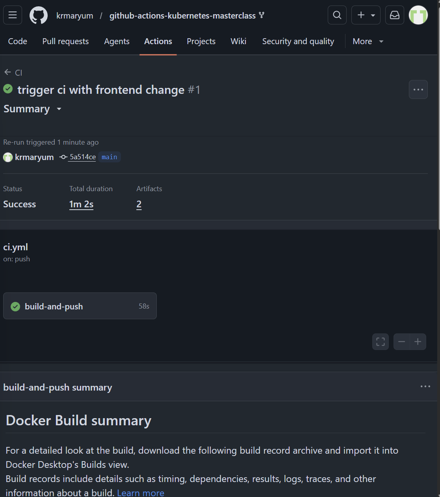
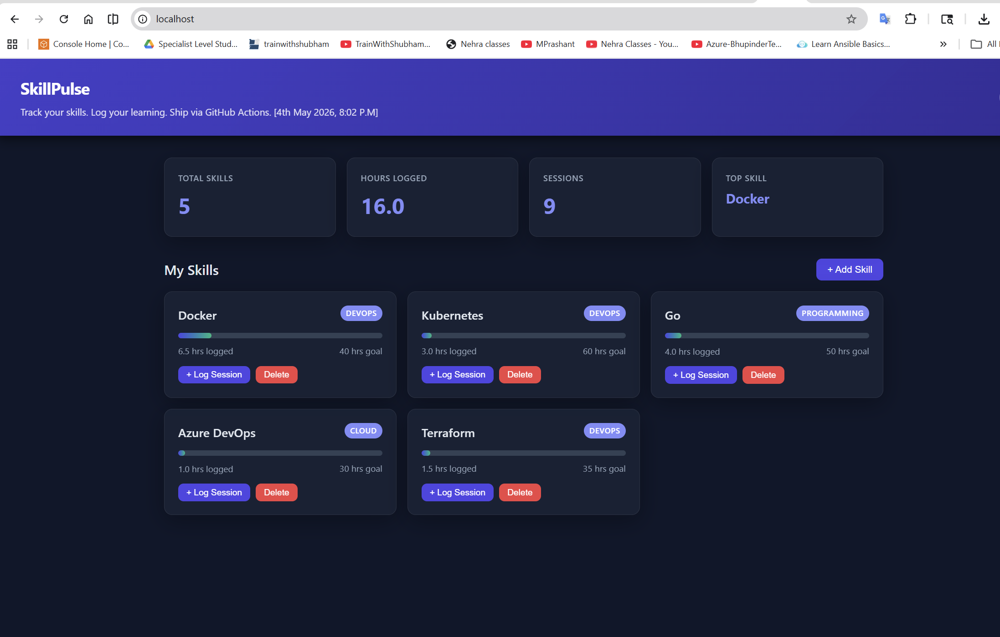
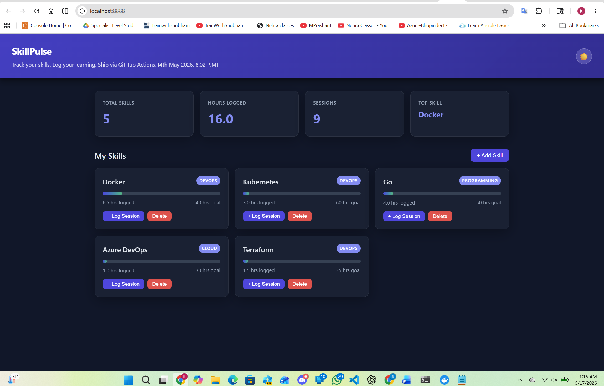

# GitHub Actions Kubernetes Masterclass – Complete Project Documentation

| Task No. | Section                        | Summary                                                    | Quick Link                                                              |
| -------- | ------------------------------ | ---------------------------------------------------------- | ----------------------------------------------------------------------- |
| 1        | Project Overview               | Introduction to SkillPulse application and DevOps workflow | [Go to Project Overview](#project-overview)                             |
| 2        | Technologies Used              | Tools and technologies used in the project                 | [Go to Technologies Used](#technologies-used)                           |
| 3        | Repository Setup               | Forking and cloning the GitHub repository                  | [Go to Repository Setup](#repository-setup)                             |
| 4        | GitHub Secrets Configuration   | Configured Docker Hub secrets and deployment variables     | [Go to GitHub Secrets Configuration](#github-secrets-configuration)     |
| 5        | Enable GitHub Actions          | Enabled workflows for the forked repository                | [Go to Enable GitHub Actions](#enable-github-actions)                   |
| 6        | CI/CD Pipeline Setup           | Triggered GitHub Actions pipeline using Git commits        | [Go to CI/CD Pipeline Setup](#cicd-pipeline-setup)                      |
| 7        | GitHub Actions Validation      | Verified Docker build and push workflow success            | [Go to GitHub Actions Validation](#github-actions-validation)           |
| 8        | Install Kubernetes Tools       | Installed `kind` and `kubectl` tools                       | [Go to Install Kubernetes Tools](#install-kubernetes-tools)             |
| 9        | ARM64 Troubleshooting          | Fixed architecture compatibility issue in WSL2             | [Go to ARM64 Troubleshooting](#arm64-troubleshooting)                   |
| 10       | Create Kubernetes Cluster      | Created Kubernetes cluster using `make up`                 | [Go to Create Kubernetes Cluster](#create-kubernetes-cluster)           |
| 11       | Kubernetes Verification        | Verified nodes, pods, and services                         | [Go to Kubernetes Verification](#kubernetes-verification)               |
| 12       | Application Deployment Testing | Tested frontend deployment in browser                      | [Go to Application Deployment Testing](#application-deployment-testing) |
| 13       | Health Check Validation        | Verified backend health endpoint                           | [Go to Health Check Validation](#health-check-validation)               |
| 14       | Final Results                  | Confirmed successful CI/CD and Kubernetes deployment       | [Go to Final Results](#final-results)                                   |
| 15       | Key Learnings                  | Important DevOps and Kubernetes concepts learned           | [Go to Key Learnings](#key-learnings)                                   |
| 16       | Conclusion                     | Final project completion summary                           | [Go to Conclusion](#conclusion)                                         |


## Project Overview

This project demonstrates a complete DevOps workflow using:

- GitHub Actions CI/CD
- Docker
- Docker Hub
- Kubernetes
- kind (Kubernetes in Docker)
- Frontend + Backend + MySQL Architecture

The application is called **SkillPulse**, a skill tracking platform.

---

# Architecture

```text
Frontend (HTML/JS)
        ↓
Backend API (Go)
        ↓
MySQL Database
```

Deployment Flow:

```text
GitHub Push
    ↓
GitHub Actions CI
    ↓
Docker Image Build
    ↓
Docker Hub Push
    ↓
Kubernetes Deployment
```

---

# Technologies Used

| Technology | Purpose |
|---|---|
| GitHub Actions | CI/CD |
| Docker | Containerization |
| Docker Hub | Image Registry |
| Kubernetes | Container Orchestration |
| kind | Local Kubernetes Cluster |
| MySQL | Database |
| Go | Backend |
| HTML/CSS/JS | Frontend |

---

# Repository

Repository URL:

```text
https://github.com/krmaryum/github-actions-kubernetes-masterclass
```

---

# Project Structure

```text
github-actions-kubernetes-masterclass/
│
├── .github/workflows/
├── backend/
├── frontend/
├── mysql/
├── k8s/
├── docs/
├── docker-compose.yml
├── Makefile
└── README.md
```

---

# Step 1 – Fork Repository

Forked and customized from:

```text
LondheShubham153/github-actions-kubernetes-masterclass
```

---

# Step 2 – Configure GitHub Secrets

Opened:

```text
GitHub Repository
→ Settings
→ Secrets and variables
→ Actions
```

Added repository secrets:

| Secret Name | Value |
|---|---|
| DOCKERHUB_USERNAME | krmaryum |
| DOCKERHUB_TOKEN | Docker Hub Access Token |

Added repository variable:

| Variable | Value |
|---|---|
| DEPLOY_ENABLED | true |

---

# Step 3 – Enable GitHub Actions

Opened:

```text
GitHub → Actions
```

Enabled workflows for forked repository.

---

# Step 4 – Trigger CI Pipeline

Created test commit:

```bash
echo "// workflow trigger" >> frontend/js/app.js

git add .
git commit -m "trigger ci with frontend change"
git push origin main
```

---




# Step 5 – GitHub Actions Pipeline Success

Pipeline stages completed:

- Checkout Code
- Docker Login
- Build Backend Image
- Build Frontend Image
- Push Docker Images

GitHub Actions status:

```text
SUCCESS ✅
```



---

# Step 6 – Install kind and kubectl

## Install kind

```bash
curl -Lo ./kind https://kind.sigs.k8s.io/dl/v0.29.0/kind-linux-arm64

chmod +x ./kind

sudo mv ./kind /usr/local/bin/kind
```

## Install kubectl

```bash
curl -LO "https://dl.k8s.io/release/$(curl -L -s https://dl.k8s.io/release/stable.txt)/bin/linux/arm64/kubectl"

chmod +x kubectl

sudo mv kubectl /usr/local/bin/
```

---

# Step 7 – Fix Architecture Issue

Initial problem:

```text
SIGSEGV segmentation violation
```

Root cause:

```text
Wrong kind binary installed (amd64 on arm64 machine)
```

Checked architecture:

```bash
hostnamectl
```

Output:

```text
Architecture: arm64
```

Installed correct ARM64 kind binary.

---

# Step 8 – Create Kubernetes Cluster

Ran:

```bash
make up
```

This created:
- kind Kubernetes cluster
- Docker image loading
- Kubernetes deployments
- Services

---

# Step 9 – Verify Kubernetes Cluster

## Nodes

```bash
kubectl get nodes
```

Output:

```text
NAME                       STATUS   ROLES           AGE     VERSION
skillpulse-control-plane   Ready    control-plane   2m39s   v1.35.1
skillpulse-worker          Ready    <none>          2m24s   v1.35.1
skillpulse-worker2         Ready    <none>          2m24s   v1.35.1
```

## Pods

```bash
kubectl get pods -n skillpulse
```

Output:

```text
NAME                        READY   STATUS    RESTARTS   AGE
backend-fb779cd7c-dbkjl     1/1     Running   0          2m25s
frontend-76b7d9db7c-d9l5h   1/1     Running   0          2m25s
mysql-0                     1/1     Running   0          2m26s
```

## Services

```bash
kubectl get svc -n skillpulse
```

Output:

```text
NAME       TYPE        CLUSTER-IP     EXTERNAL-IP   PORT(S)        AGE
backend    ClusterIP   10.96.64.0     <none>        8080/TCP       2m33s
frontend   NodePort    10.96.96.218   <none>        80:30080/TCP   2m32s
mysql      ClusterIP   None           <none>        3306/TCP       2m33s
```

---

# Step 10 – Application Testing

Opened application:

```text
http://localhost:8888
```



Application loaded successfully.

---

# Step 11 – Health Check

Executed:

```bash
curl http://localhost:8888/health
```

Response:

```json
{"status":"healthy"}
```

---

# Final Result

## CI/CD Completed

✅ GitHub Actions Working  
✅ Docker Builds Working  
✅ Docker Hub Push Working  

## Kubernetes Completed

✅ kind Cluster Working  
✅ Frontend Running  
✅ Backend Running  
✅ MySQL Running  
✅ Services Working  

## Application Testing

✅ Browser Access Working  
✅ Health Check Working  

---

# Key Learnings

- GitHub Actions workflow automation
- Docker image build and push
- Docker Hub authentication
- Kubernetes deployments
- kind cluster management
- Debugging CI/CD failures
- ARM64 architecture troubleshooting
- Service exposure using NodePort

---

# Conclusion

This project successfully demonstrates a complete DevOps workflow integrating:
- GitHub Actions
- Docker
- Docker Hub
- Kubernetes
- kind

The application was deployed successfully and verified through browser testing and API health checks.

# Project Status

```text
COMPLETED SUCCESSFULLY
```

